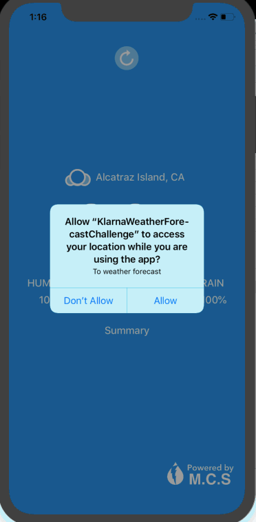

<h1>Swift Weather App</h1>

Allows the user to view the current weather.  
MVC(Model-View-Controller) architectural pattern was used.

<h2>Externally Used Library</h2>
<a href = "https://darksky.net/dev">DarkSky api</A> returns the current weather data by longitude, latitude, and private key sent. 
<a href = "https://github.com/vikmeup/SCLAlertView-Swift" >SCLAlertView</a> is a beautiful animated Alert View 
<a href = "https://github.com/Alamofire/Alamofire">Alamofire</a> fetch data from server as JSON data type.  

<h2>Screenshot</h2>

